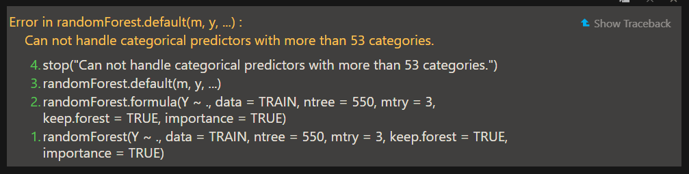

# Data

## Input Data

```{r message=FALSE, warning=FALSE}
# Ganti folder
path <- function() gsub ("\\\\", "/", readClipboard() )
setwd("C:/Users/Fathan/Documents/Obsidian Vault/2. Kuliah/Smt 6/2. Teknik Pembelajaran Mesin/Project/Tugas Aida")

# Baca Data
library(dplyr)
raw.data <- read.csv("Data.csv", sep=";") %>% #Baca csv
  as.data.frame() # Ubah sebagai dataframe
data <- raw.data

# Tampilkan data
View(data)
```

## Check Data

> **Cek tipe data**

```{r}
str(data)
```

> **Cek data hilang**

```{r}
colSums(is.na(data))
```

Tidak ada data hilang pada setiap kolom.

## Eksplorasi data {.tabset}

```{r fig.height=15, fig.width=35, dpi=300}
par(mfrow = c(2,6))
hist(data[,1], main="Y - Emisi CO2", cex.main=4)
hist(data[,2], main="X1 - Engine Size.L", cex.main=4)
barplot(table(data[,2]), main="X1 - Engine Size.L", cex.main=4)
hist(data[,3], main="X2 - Fuel Consum.L/km", cex.main=4)
hist(data[,4], main="X3 - Fuel Consum.L/km", cex.main=4)
hist(data[,5], main="X4 - Fuel Consum.L/km", cex.main=4)
barplot(table(data[,6]), main="X5 - Make", cex.main=4)
barplot(table(data[,7]), main="X6 - Model", cex.main=4)
barplot(table(data[,8]), main="X7 - Vehicle.Class", cex.main=4)
barplot(table(data[,9]), main="X8 - Cylinders", cex.main=4)
barplot(table(data[,10]), main="X9 - Transmission", cex.main=4)
barplot(table(data[,11]), main="X10 - Fuel.Type", cex.main=4)
```

### X1 & X8

Dari sini kita bisa melihat bahwa X1 walaupun satuannya liter, namun bukan peubah kontinu. Ini bisa dilihat dari histogramnya yang penuh dnegan celah, mari kita lihat lebih dalam:

```{r}
unique(data[,2])
```

Terlihat bahwa jumlah nilai diskritnya terbatas dan sering mewakili kategori yang dibulatkan. Misalnya, mesin dengan ukuran sebenarnya 4.8 liter mungkin dikategorikan sebagai 5 liter.

Selain itu, nilai-nilai ini sering digunakan untuk mengklasifikasikan kendaraan ke dalam kelompok ukuran mesin tertentu, seperti mesin kecil, sedang, dan besar. Oleh karena itu, perlakuan data ini sebagai **kategorik lebih tepat** dalam beberapa analisis dan visualisasi, mencerminkan penggunaan praktis dalam klasifikasi ukuran mesin.

```{r}
unique(data[,9])
```

Begitu pula dengan X8 yakni banyaknya silinder, sehingga kedua peubah ini akan dijadikan sebagai peubah kategorik.

### X5 - X9

Saking banyaknya kategori yang ada, bar chart yang dihasilkan nyaris nampak seperti histogram. Mari kita liat:

```{r}
cat(  "Jumlah baris       =", nrow(data),
    "\nBanyaknya kategori:",
    "\nX5 (Make)          =", length(unique(data[,6])),
    "\nX6 (Model)         =", length(unique(data[,7])),
    "\nX7 (Vehicle.Class) =", length(unique(data[,8])),
    "\nX9 (Transmission)  =", length(unique(data[,10]))
    )
```

Terlihat bahwa walaupun bar chart X6 terlihat sangat chaos, namun banyaknya kategori hanya 2000 saja., tidak sama dengan jumlah baris. Ini artinya X6 tidak semuanya unik. Ya sebenarnya bisa langsung dilihat dari tinggi rendahnya bar chart sih. Ini mah biar bisa liat begitu banyaknya kategori model pada X6 saja.



Akan tetapi, random forrest tidak mampu memodelkan lebih dari 53 kategori, sehingga alangkah baiknya jika X6 dikeluarkan dari analisis.

### Y (Respon)

Mari kita lihat lebih dalam untuk sebaran data

```{r fig.height=4.5, fig.width=10, message=FALSE, warning=FALSE, dpi=300}
library(ggplot2)
library(cowplot)

# Histogram
p1 <- ggplot(data, aes(x = `CO2.Emissions.g.km.`)) +
  geom_histogram(binwidth = 20, fill = "#89b49e", color = "black") +
  ylab("Frekuensi") + theme_void()

# Boxplot
p2 <- ggplot(data, aes(y = `CO2.Emissions.g.km.`)) +
  geom_boxplot(fill = "#89b49e", color = "black", outlier.size = 3) +
  xlab("Nilai") + theme_void() + coord_flip()

# Gabung plot
combined_plot <- plot_grid(p1, p2, ncol = 1, align = 'v',
                           rel_heights = c(1, 0.25))

# Menambahkan judul utama
title <- ggdraw() + 
  draw_label("Y - Emisi CO2", fontface = 'bold', x = 0.5, hjust = 0.5, size = 20)

# Menampilkan plot dengan judul utama
plot_grid(title, combined_plot, ncol = 1, rel_heights = c(0.1, 1))
```

Terlihat bahwa data menjulur ke kanan dan nampak memiliki banyak sekali outlier di sisi kanan.

## Cleaning Data

> **Ubah tipe data**

```{r}
data <- data[,-7] %>% # Mengeluarkan X6
  mutate_at(vars(2, 9), as.character) # Mengubah menjadi character 

data <- data %>%
  mutate_if(is.character, as.factor) # Mengubah char menjadi faktor
str(data)
```

Dengan ini data sudah benar dan siap untuk dianalisis.

## Split Data

```{r message=FALSE, warning=FALSE}
library('caret')
set.seed(1401211016)

# Membuat index partisi data
data.a <- data
colnames(data.a) <- c("Y","X1","X2","X3","X4","X5","X7","X8","X9","X10")
trainIndex <- createDataPartition(data.a$Y, # Salah satu peubah X
                                  p = .8, # 80% data Train, 20% data Test
                                  list = FALSE)
# Membagi data train dan test
TRAIN <- data.a[trainIndex, ]
TEST <- data.a[-trainIndex, ]
```

# Modeling

*K-fold cross validation* adalah salah satu teknik validasi untuk mencari *tuning parameter* terbaik sekaligus mengevaluasi kinerja model. Pada studi kasus ini digunakan *5-fold cross validation*. Data dipartisi secara acak ke dalam lima subset data. Secara bergantian masing-masing subset akan dijadikan sebagai data testing, sementara empat subset data lainnya sebagai data training.

```{r}
fitControl <- trainControl(
  method = "cv",
  number = 5,
  returnResamp = "all")
```

## Train model

### **Tuning Parameter dengan `tuneLength`**

Opsi `tuneLength` pada fungsi `caret::train` akan memilih sejumlah *tuning parameter* atau kombinasi *tuning parameter* yang dianggap paling tepat sesuai dengan metode yang dipilih dan data training yang diberikan.

#### **Cross Validation**

```{r message=FALSE, warning=FALSE}
library('randomForest')
rf <- train(Y ~ ., 
            data = TRAIN,
            method = 'ranger',
            tuneLength = 10, 
            importance = "impurity",
            trControl = fitControl,
            verbose = FALSE)
rf
```

Hasil validasi silang ditampilkan pada plot berikut:

```{r}
plot(rf, main = "5-Fold Cross Validation Random Forest: tuneLength")
```

## Info Model

```{r}
options(max.print = 50)
getTree(rf_model, 1)
```

> **Decision Tree**

```{r fig.height=15, fig.width=40, message=FALSE, warning=FALSE, dpi=300}
# devtools::install_github('araastat/reprtree') # Buat install
reprtree:::plot.getTree(rf_model,k=1)
```

```{r fig.height=15, fig.width=40, message=FALSE, warning=FALSE, dpi=300}
reprtree:::plot.getTree(rf_model,k=4)
```

```{r fig.height=15, fig.width=40, message=FALSE, warning=FALSE, dpi=300}
reprtree:::plot.getTree(rf_model,k=500)
```

## **Feature Importances**

```{r}
varImp(rf_model)
```

```{r}
importance(rf_model)
```

```{r}
varImpPlot(rf_model)
```

```{r}
varImpPlot(rf_model, type=1)
```

```{r}
varImpPlot(rf_model, type=2)
```

## **Score Training Set**

```{r}
y_hat <- predict(rf_model, TRAIN)

TRAIN.rf_scored <- as_tibble(cbind(TRAIN, y_hat))
glimpse(TRAIN.rf_scored)
```

> **Confusion Matrix on Training Set**

```{r}
RMSE_rf_Train <- yardstick::rmse(TRAIN.rf_scored, 
                                 truth=Y, estimate=y_hat)

RMSE_rf_Train
```

# **Score Test Set**

```{r}
y_hat <- predict(rf_model, TEST)

test.rf_scored <- as_tibble(cbind(TEST, y_hat))

glimpse(test.rf_scored)
```

## **Testing Set Confusion Matrix**

```{r}
RMSE_rf_TEST <- yardstick::rmse(test.rf_scored, 
                                truth=Y, estimate=y_hat)

RMSE_rf_TEST
```
